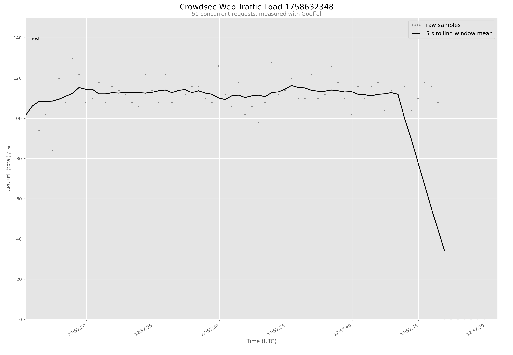
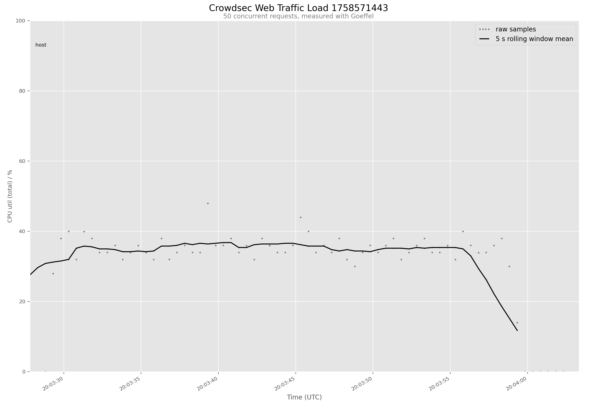
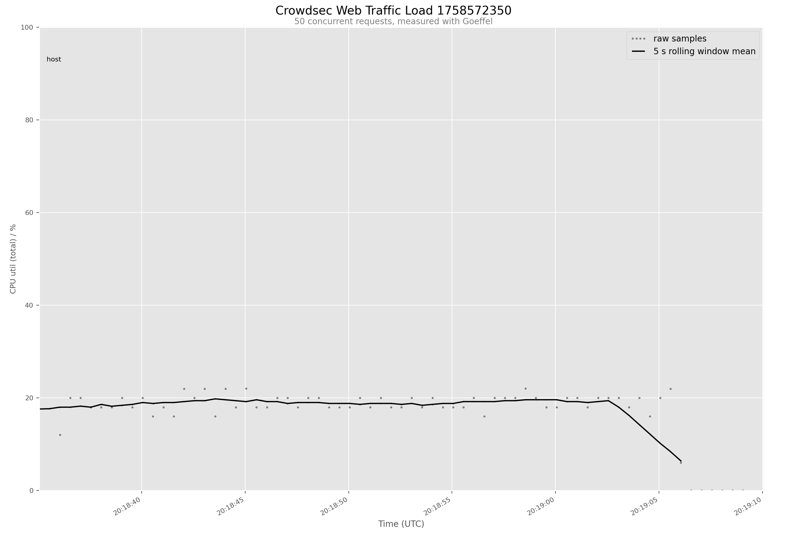

# Benchmark Results

## Load Paramaters

All loads were run with

```env
TARGET=50
DURATION=30
RANDOMIZE=true
```

So, 50 requests/s over a duration of 30 seconds using [`bench.sh`](../bench.sh)

### Rapberry Pi4

* [DietPi OS](https://dietpi.com/) (bullseye)
* Kernel `6.1.21-v8+`



### Raspberry Pi5

* [Rasperry Pi OS](https://www.raspberrypi.com/software/) (bookworm)
* Kernel `6.6.51+rpt-rpi-2712`



### i5-6500T

* Debian (bookworm)
* Kernel `6.1.0-38-amd64`


### i5-13400

* Debian (bookworm)
* Kernel `6.1.0-38-amd64`
* 10core VM on Promxox
  


### 5700x

* Arch
* Kernel `6.14.7-arch2-1`
  
